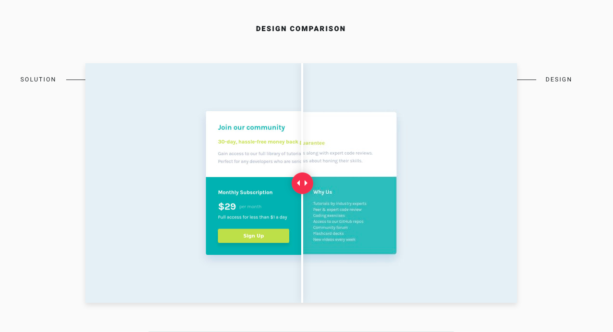

# [Frontend Mentor](frontendmentor.io/) - Single price grid component

## The challenge
The challenge is to build out this landing page and get it looking as close to the design as possible.
Users should be able to:

- View the optimal layout for the component depending on their device's screen size
- See a hover state on desktop for the Sign Up call-to-action

## Link

- Live Site URL: [https://dinahbrito.github.io/single-price-grid-component/](https://dinahbrito.github.io/single-price-grid-component/)

## Technologies used

- Semantic HTML5 markup
- Flexbox
- CSS Grid

